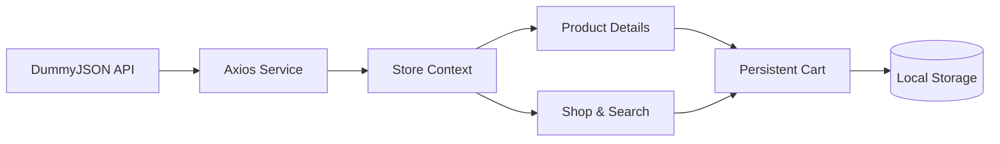

<div align="center">

# 🛍️ ShopNest

### A modern, responsive e-commerce storefront built with React

[](https://react.dev/)
[](https://reactrouter.com/)
[](https://axios-http.com/)
[](#available-scripts)
[](#responsive-design)

**ShopNest** turns a public product API into a polished shopping experience with product discovery, intelligent filtering, persistent cart management, responsive layouts, and user-friendly feedback.

</div>

---

## ✨ Why this project stands out

ShopNest is more than a static shopping template. It demonstrates how a real storefront can be structured around reusable React components, centralized state, API-driven content, and clear customer journeys.

- Products are fetched dynamically instead of being hard-coded.
- Search terms are stored in the URL, making result pages shareable.
- A single source of truth manages catalog and cart state.
- Cart contents survive page refreshes using browser storage.
- Every important action gives immediate visual feedback.
- The interface adapts cleanly across desktop, tablet, and mobile.

## 🚀 Features

### Product discovery

- API-powered product catalog
- Dedicated Men and Women collections
- Keyword search across product names, descriptions, and categories
- Category-based filtering
- Sorting by featured products, rating, and price
- Helpful loading, error, and empty-result states

### Shopping experience

- Reusable product cards with rating, price, discount, and category
- Detailed product pages with stock information
- Quantity selection before adding an item
- Animated **Add to cart** notification with product details
- Responsive navigation with live cart count

### Cart management

- Add multiple products to one cart
- Increase or decrease individual item quantities
- Remove individual products or clear the complete cart
- Automatically calculated subtotal, delivery fee, and grand total
- Free-delivery threshold indicator
- Cart persistence through `localStorage`
- Friendly checkout-unavailable notification for the demo environment

### Additional pages

- Brand-focused landing page
- About page with store values
- Contact form with successful-submission feedback
- Responsive footer with useful navigation
- Graceful fallback for unknown routes

## 🧰 Tech stack

| Technology | Purpose |
| --- | --- |
| React 19 | Component-based user interface |
| React Router 7 | Client-side routing and URL search state |
| Context API | Shared product and cart state |
| Axios | Product API communication |
| React Icons | Consistent interface icons |
| CSS3 | Custom responsive design and animations |
| Local Storage | Persistent shopping cart |
| DummyJSON | External product catalog API |

## 🏗️ Architecture

```text
src/
├── component/
│   ├── Header.js          # Navigation, search, and cart indicator
│   ├── Footer.js          # Shared footer navigation
│   ├── ProductCard.js     # Reusable catalog card
│   └── Singleproduct.js   # Product details and quantity selection
├── context/
│   └── StoreContext.js    # Products, cart operations, totals, and notifications
├── pages/
│   ├── Home.js            # Landing page and featured products
│   ├── Shop.js            # Search, filters, sorting, and collections
│   ├── Cart.js            # Cart editing and order summary
│   ├── About.js           # Brand story
│   └── Contact.js         # Contact form
├── router/
│   └── Mainroute.js       # Application route configuration
├── Service api/
│   ├── ExiosApi.js        # Configured Axios client
│   ├── Baseurl.js         # API base URL
│   └── Productlist.js     # Product retrieval service
├── index.css              # Global responsive design system
└── toast.css              # Cart and checkout notifications
```

### Data flow



## 📱 Responsive design

The UI was designed mobile-first with dedicated behavior for different screen sizes:

- Collapsible navigation on smaller screens
- Fluid product grids from four columns down to two
- Stacked product, cart, about, and contact layouts
- Mobile-friendly forms, buttons, filters, and notifications
- Flexible typography powered by CSS `clamp()`

## ⚙️ Getting started

### Prerequisites

- [Node.js](https://nodejs.org/) 18 or newer
- npm 9 or newer

### Installation

```bash
git clone https://github.com/Gourav7581/ecommerce-store.git
cd ecommerce-store
npm install
npm start
```

The development server will open at [http://localhost:3000](http://localhost:3000).

## 📜 Available scripts

| Command | Description |
| --- | --- |
| `npm start` | Starts the local development server |
| `npm test -- --watchAll=false` | Runs the test suite once |
| `npm run build` | Creates an optimized production build |

## 🔌 API

Product data is provided by the public [DummyJSON Products API](https://dummyjson.com/docs/products).

```http
GET https://dummyjson.com/products?limit=100
```

The service layer keeps API logic separate from UI components, making it straightforward to replace DummyJSON with a custom backend later.

## 💡 Engineering decisions

- **Centralized store:** Product fetching and cart operations live in Context instead of being duplicated across pages.
- **Derived totals:** Item count, subtotal, and order total are calculated from cart state to prevent inconsistent values.
- **Persistent state:** Cart changes are synchronized with `localStorage` through an effect.
- **URL-driven search:** Search queries use `/shop?q=...`, so navigation remains predictable and browser-friendly.
- **Reusable catalog:** The same Shop component powers all products, Men, and Women views through configuration.
- **Honest demo behavior:** Checkout does not pretend to place an order when no payment backend exists.

## 🗺️ Future roadmap

- User authentication and account management
- Secure backend with database persistence
- Payment gateway and complete checkout flow
- Wishlist and product comparison
- Product reviews and ratings submission
- Order history and shipment tracking
- Admin dashboard for catalog and inventory management
- Automated component and end-to-end test coverage

## ⚠️ Current scope

This is a frontend portfolio project. DummyJSON provides read-only demonstration data, while the cart is stored locally in the browser. Payments, authentication, inventory updates, and real order submission require a secure backend and are intentionally outside the current scope.

## 👨‍💻 Author

Built with care as a frontend development portfolio project.

> Add your name, portfolio URL, LinkedIn profile, and live deployment link here before publishing the repository.

---

<div align="center">

If you found this project useful, consider giving the repository a ⭐

</div>
